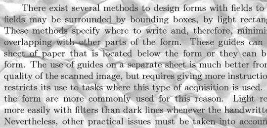
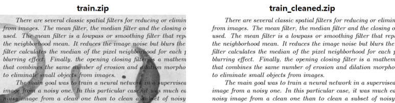

# Image_Autoencoder

## kaggle 'Denoising Dirty Document' 데이터 활용하여 Autoencoder 구현

- train : 노이즈가 포함된 입력 데이터 -> 입력 층
- train_cleaned : 노이즈가 없는 입력 데이터 -> 출력 층에서 train의 타겟 역
- test : 노이즈가 포함된 모델이 노이즈를 잘 제거하는지를 확인하기 위한 데이터

